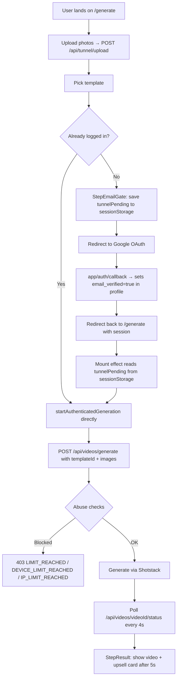

# Reeltors.ai — Developer Onboarding Wiki

> **Goal:** Get a new developer from zero to productive in 30 minutes.

---

## 1. Project Executive Summary

**What is it?**
Reeltors.ai is an AI-powered real estate video factory. It takes a set of listing photos and returns a cinematic, social-media-ready video (TikTok / Instagram Reels format) in under 90 seconds — no editing skills required.

**Who is it for?**
US-based real estate agents aged 45–65 who need video content to compete but have no time or skill for video editing. The core insight: agents who post listing videos get 3× more inquiries. Reeltors.ai removes every obstacle between "I have listing photos" and "I have a viral video."

**Core value proposition:**
> *"Your listing photos are sitting on Zillow. Their videos are going viral."*

Agents upload 3–15 photos, pick a visual style, and a cinematic listing video is generated and delivered — automatically, at a fraction of the cost of a videographer.

---

## 2. Technical Stack

### Frontend & Backend
| Layer | Technology | Notes |
|---|---|---|
| Framework | Next.js 14.2 (App Router) | All routes under `app/`. Server Components by default, `'use client'` only for interactive components. |
| Styling | Tailwind CSS | Light mode, warm off-white palette. Design targets older, non-technical realtors. |
| Auth | Supabase Auth | Google OAuth + email magic link. Auth state managed via `@supabase/ssr`. |
| Payments | Stripe | Subscription billing with webhooks. Plans: Free / Starter ($49) / Growth ($99) / Pro ($199). |
| Email | Resend | Transactional emails: welcome, video ready, OTP codes, payment failures. |
| Hosting | Vercel | All functions run on Fluid Compute (Node.js 24). `maxDuration = 300` for AI generation routes. |

### Database & Storage
| Layer | Technology | Notes |
|---|---|---|
| Database | Supabase (PostgreSQL) | Tables: `profiles`, `videos`, `tunnel_sessions`, `email_verifications`, `free_generation_logs` |
| File Storage | Supabase Storage | Bucket: `output-videos`. Path pattern: `{userId}/{renderId}.mp4`. Videos stored with 1-year cache. |

### AI & Video Pipeline
| Layer | Technology | Why |
|---|---|---|
| AI Inference | fal.ai — Kling v1.6 Standard | Generates 5-second cinematic drone-shot clips from static listing photos. Runs async via fal.ai queue REST API (no SDK). Up to 3 clips per video, run in parallel. |
| Video Assembly | **Shotstack** (stage env for dev, v1 for prod) | Assembles images + AI clips into the final MP4 with Ken Burns effects, text overlays (price, address, agent name), transitions, and audio. |

#### Why Shotstack? (The Creatomate → Shotstack Pivot)
The project originally used Creatomate (pre-built template UUIDs). It was abandoned for two reasons:
1. **Cost at scale** — Creatomate charges per render at a fixed rate. Shotstack's timeline API gives full control and better margins.
2. **No UUID dependency** — Creatomate required uploading and maintaining template files with hardcoded UUIDs. Shotstack generates videos from a JSON timeline spec at render time, so there is nothing to maintain in an external dashboard.

**Rule for future devs: never suggest going back to Creatomate or any template-UUID-based renderer. The timeline-first approach is non-negotiable.**

### Abuse Prevention
| Layer | Technology | Notes |
|---|---|---|
| Device fingerprinting | FingerprintJS (client-side `x-device-fingerprint` header) | Prevents the same device from claiming multiple free generations |
| Email filtering | `disposable-email-domains` npm package | Blocks throwaway email domains on every free-tier request |
| IP rate limiting | Supabase `tunnel_sessions` table | Blocks >1 session per IP per 24-hour window |

---

## 3. Core Logic Flows

### 3A. Video Generation Pipeline (Paid/Authenticated Users)

```
User on /create
    │
    ▼
POST /api/videos/generate
    │
    ├─ Auth check (Supabase session)
    ├─ Disposable email check
    ├─ Load profile + plan limit check (videos_used_this_month >= videos_limit → 403)
    ├─ Abuse checks (email_verified, IP/fingerprint vs free_generation_logs)
    │
    ├─ INSERT videos record (status: 'pending')
    │
    ├─ [Optional] fal.ai drone shots
    │       └─ generateDroneShotsForIndices(images, aiVideoIndices)
    │              └─ Up to 3 clips in parallel via fal.ai queue REST API
    │              └─ Falls back to static images if fal.ai fails
    │
    ├─ Build Shotstack timeline (buildTimeline in lib/shotstack/client.ts)
    │       └─ Media track: images + AI videos with Ken Burns / zoomIn / zoomOut effects
    │       └─ Text track: price lower-third, agent name overlay (HTML clips)
    │
    ├─ POST to Shotstack API → returns render ID immediately
    │
    ├─ UPDATE videos record (status: 'processing', render_id: shotstackId)
    ├─ RPC increment_videos_used
    │
    └─ Return { videoId, renderId } to client
           │
           ▼
    Client polls GET /api/videos/{videoId}/status (every 4 seconds)
           │
           ├─ If webhook already fired → return DB status (fast path)
           └─ Else → call getRenderStatus(renderId) directly on Shotstack
                  └─ On done: downloadAndStoreVideo() → Supabase Storage → UPDATE complete
```

**Webhook path (preferred, faster):**
```
Shotstack render completes
    │
    ▼
POST /api/webhooks/shotstack?token={WEBHOOK_SECRET}&video_id={id}&user_id={id}
    │
    ├─ Verify token
    ├─ On 'done': downloadAndStoreVideo() → Supabase Storage
    ├─ UPDATE videos (status: 'complete', output_url: permanentUrl)
    └─ sendFirstVideoEmail() via Resend
```

> **The 24-Hour Rule:** Shotstack deletes rendered files from their CDN after 24 hours. `downloadAndStoreVideo()` in `lib/storage.ts` immediately downloads and re-uploads to Supabase Storage (`output-videos` bucket) on every successful render. The `output_url` stored in the DB is always the permanent Supabase URL, never the Shotstack CDN URL. If `downloadAndStoreVideo()` throws, we fall back to the temporary CDN URL as a safety net — but this will break after 24h. **Always confirm Supabase Storage is healthy before deploying.**

---

### 3B. Free Trial Flow (`/generate`)

The unauthenticated tunnel at `/generate` lets realtors try the product before signing up. It enforces a strict 1-video-per-person limit.



**Abuse stack (layered):**

| Layer | Check | Block code |
|---|---|---|
| 1 | Disposable email domain | `DISPOSABLE_EMAIL` |
| 2 | `email_verified = false` on profile | `EMAIL_NOT_VERIFIED` |
| 3 | Same fingerprint used by different account in last 30 days | `DEVICE_LIMIT_REACHED` |
| 4 | Same IP used by different account in last 30 days | `IP_LIMIT_REACHED` |
| 5 | `videos_used_this_month >= videos_limit` | `LIMIT_REACHED` |
| 6 | Concurrent session on different device (paid plans) | `CONCURRENT_SESSION` |

Free users hit layers 1–5. Paid users hit layers 1, 5, and 6.

---

## 4. Environment Variables

### `.env.local` (local dev)

```bash
# ── Supabase ──────────────────────────────────────────────────────────────────
NEXT_PUBLIC_SUPABASE_URL=https://your-project.supabase.co
NEXT_PUBLIC_SUPABASE_ANON_KEY=eyJ...
SUPABASE_SERVICE_ROLE_KEY=eyJ...          # Never expose to client. Admin-level DB access.

# ── Shotstack ─────────────────────────────────────────────────────────────────
SHOTSTACK_API_KEY=hw0VH04...              # Stage key = sandbox with watermarks (dev/testing)
SHOTSTACK_ENV=stage                       # 'stage' = sandbox, 'v1' = production

# ── fal.ai ────────────────────────────────────────────────────────────────────
FAL_KEY=your-fal-api-key                 # Kling v1.6 Standard model. Leave unset to skip AI shots.

# ── Stripe ────────────────────────────────────────────────────────────────────
STRIPE_SECRET_KEY=sk_test_...
STRIPE_WEBHOOK_SECRET=whsec_...          # Register at dashboard.stripe.com/webhooks
STRIPE_PRICE_STARTER=price_...          # Monthly price IDs from Stripe dashboard
STRIPE_PRICE_STARTER_ANNUAL=price_...
STRIPE_PRICE_PRO=price_...              # Note: env var named PRO maps to "growth" plan
STRIPE_PRICE_GROWTH_ANNUAL=price_...
STRIPE_PRICE_TEAM=price_...             # Note: env var named TEAM maps to "pro" plan
STRIPE_PRICE_PRO_ANNUAL=price_...

# ── Resend ────────────────────────────────────────────────────────────────────
RESEND_API_KEY=re_...
RESEND_FROM_EMAIL=support@reeltors.ai   # Must be a verified domain in Resend

# ── App ───────────────────────────────────────────────────────────────────────
NEXT_PUBLIC_APP_URL=http://localhost:3000  # No trailing slash. Used for webhook callback URLs.
WEBHOOK_SECRET=your-random-secret          # Optional. Validates incoming Shotstack webhooks.

# ── Dev Tools ─────────────────────────────────────────────────────────────────
MOCK_AI=true   # Set to skip fal.ai + Shotstack API calls entirely. Returns sample video URLs.
               # Use this to test UI/layout changes for free without burning API credits.
```

### Shotstack Stage vs. Production

| Variable | `SHOTSTACK_ENV=stage` | `SHOTSTACK_ENV=v1` |
|---|---|---|
| API endpoint | `https://api.shotstack.io/edit/stage/render` | `https://api.shotstack.io/edit/v1/render` |
| Watermark | **Yes** — "Shotstack" watermark on all renders | No watermark |
| Cost | Free / dev quota | Billed per render |
| Use for | Local dev, testing, CI | Production only |

**When to switch to prod:** Set `SHOTSTACK_ENV=v1` and use your production Shotstack API key in Vercel environment variables before going live.

### MOCK_AI Mode

Setting `MOCK_AI=true` bypasses both fal.ai and Shotstack entirely:
- `generateDroneShot()` → returns a hardcoded sample MP4 URL immediately
- `getRenderStatus()` → returns `{ status: 'done', url: sampleMp4 }` immediately

This lets you iterate on UI, polling logic, and the result screen without spending API credits.

---

## 5. Database Schema

### `profiles` (one per user, created by `handle_new_user` trigger on `auth.users`)
```sql
id                              UUID  PK  -- matches auth.users.id
email                           TEXT
full_name                       TEXT
phone                           TEXT
brand_name                      TEXT
stripe_customer_id              TEXT
subscription_id                 TEXT
subscription_status             TEXT  -- free | active | past_due | canceled | trialing
plan                            TEXT  -- free | starter | growth | pro | team
videos_used_this_month          INT   DEFAULT 0
videos_limit                    INT   DEFAULT 1     -- set by Stripe webhook on plan change
billing_cycle_start             TIMESTAMPTZ
email_verified                  BOOL  DEFAULT false -- set true on Google OAuth callback
session_fingerprint             TEXT                -- latest FingerprintJS visitor ID
session_fingerprint_updated_at  TIMESTAMPTZ
```

### `videos` (one per generation job)
```sql
id                  UUID  PK
user_id             UUID  FK → profiles.id
title               TEXT
status              TEXT  -- pending | processing | complete | failed
render_id           TEXT  -- Shotstack render ID (was: creatomate_render_id, renamed in migration 002)
template_id         TEXT  -- Shotstack template key (e.g. 'CINEMATIC')
listing_address     TEXT
listing_price       TEXT
agent_name          TEXT
source_images       TEXT[]
output_url          TEXT  -- permanent Supabase Storage URL (never Shotstack CDN)
thumbnail_url       TEXT
format              TEXT  -- vertical | square | horizontal
created_at          TIMESTAMPTZ
updated_at          TIMESTAMPTZ
```

### `tunnel_sessions` (free trial, unauthenticated)
```sql
id                   UUID  PK
session_token        TEXT  UNIQUE  -- generated in browser
email                TEXT
ip_address           TEXT
device_fingerprint   TEXT
template_id          TEXT
source_images        TEXT[]
render_id            TEXT           -- Shotstack render ID
output_url           TEXT
thumbnail_url        TEXT
status               TEXT  -- uploading | generating | complete | failed | blocked
abuse_blocked_reason TEXT
has_downloaded       BOOL  DEFAULT false
```

### `email_verifications`
OTP codes for email verification. Each code is SHA-256 hashed, expires in 10 minutes, max 5 attempts.

### `free_generation_logs`
Audit log of every free-tier generation attempt. Stores `user_id`, `ip_address`, `fingerprint_id`. Used for cross-account IP/device abuse detection.

### Migrations
```
supabase/tunnel_migration.sql           -- Creates tunnel_sessions table
supabase/migrations/001_abuse_protection.sql  -- email_verifications, free_generation_logs, profile columns
supabase/migrations/002_rename_render_id.sql  -- Renames creatomate_render_id → render_id
```
**Always run new migrations in Supabase SQL editor before deploying code that references new columns.**

---

## 6. API Routes Reference

### Video Generation
| Route | Method | Auth | Purpose |
|---|---|---|---|
| `/api/videos/generate` | POST | Required | Main generation endpoint. Runs fal.ai + Shotstack pipeline. `maxDuration=300`. |
| `/api/videos/[id]/status` | GET | Required | Polls Shotstack directly for render status. Fallback when webhook hasn't fired yet. |
| `/api/videos/status/[renderId]` | GET | Required | Alternate poller by Shotstack render ID. Used for Realtime fallback. |
| `/api/videos/[id]` | DELETE | Required | Deletes video record + Supabase Storage files. |

### Free Tunnel
| Route | Method | Auth | Purpose |
|---|---|---|---|
| `/api/tunnel/upload` | POST | None | Uploads listing photos to Supabase Storage under `tunnel/{sessionToken}/`. |
| `/api/tunnel/generate` | POST | None | Runs abuse checks, creates `tunnel_sessions` record, fires Shotstack render. |
| `/api/tunnel/status/[sessionId]` | GET | None | Returns `{ status, outputUrl, thumbnailUrl }` for a tunnel session. |

### Webhooks
| Route | Method | Auth | Purpose |
|---|---|---|---|
| `/api/webhooks/shotstack` | POST | Token (`?token=`) | Receives Shotstack render completion. Downloads video → Supabase Storage → updates DB → sends email. Handles both authenticated videos and tunnel sessions via query params. |
| `/api/webhooks/stripe` | POST | Stripe signature | Handles subscription lifecycle: checkout completed, subscription updated/deleted, payment failed. Updates `profiles.plan` and `profiles.videos_limit`. |
| `/api/webhooks/creatomate` | — | — | **DELETED** — Creatomate is no longer used. |

### Auth
| Route | Method | Purpose |
|---|---|---|
| `/api/auth/google` | GET | Redirects to Google OAuth with `next` param |
| `/auth/callback` | GET | Exchanges OAuth code for session. Sets `email_verified=true` for Google users. |
| `/api/auth/send-otp` | POST | Sends 6-digit OTP to email via Resend |
| `/api/auth/verify-otp` | POST | Validates OTP, marks profile `email_verified=true` |

### Billing
| Route | Method | Purpose |
|---|---|---|
| `/api/checkout` | POST | Creates Stripe Checkout session. Supports `annual=true` param. |
| `/api/billing/portal` | POST | Creates Stripe Customer Portal session for self-serve billing management. |

### Admin (protected by admin middleware)
| Route | Method | Purpose |
|---|---|---|
| `/api/admin/stats` | GET | Platform-wide counts: users, videos, revenue |
| `/api/admin/users` | GET | Paginated user list with plan/usage data |
| `/api/admin/users/[id]` | PATCH/DELETE | Update plan or delete user |
| `/api/admin/videos` | GET | All videos across all users |

### Utility
| Route | Method | Purpose |
|---|---|---|
| `/api/cron/reset-usage` | GET | Resets `videos_used_this_month = 0` for all users. Triggered monthly by Vercel Cron. |
| `/api/users/welcome` | POST | Sends welcome email after first sign-up. |
| `/api/feedback` | POST | Routes user feedback to `support@reeltors.ai` via Resend. |

---

## 7. Local Development Setup

### Prerequisites
- Node.js 20+, npm
- Supabase CLI (optional, for local DB)
- Vercel CLI (`npm i -g vercel`)

### First-time setup
```bash
git clone https://github.com/Ahmedmkarrar/reeltors.ai
cd reeltors.ai
npm install

# Pull environment variables from Vercel (requires vercel link)
vercel env pull .env.local

# OR manually copy and fill in:
cp .env.example .env.local
```

### Run locally
```bash
npm run dev       # http://localhost:3000
npm test          # Run Vitest suite (54 tests)
npm run build     # Production build check
```

### Mock mode (free, no API calls)
Add to `.env.local`:
```bash
MOCK_AI=true
```
This lets you test the full generate → poll → result UI flow without spending Shotstack or fal.ai credits. The sample video URL is a real MP4 so the player works.

### Deploying to Vercel
```bash
vercel --prod     # Deploys to production after confirmation
```
Or push to `main` — GitHub Actions CI runs tests first (`.github/workflows/ci.yml`).

---

## 8. The Mac Mini Setup (Local Inference)

The Mac Mini runs a local instance of **Qwen 2.5** (via Ollama or LM Studio) as a JSON orchestration agent. It is **not** required for the core video pipeline — it is used for internal tooling and prompt engineering experiments.

**What it does:**
- Accepts a listing description (address, price, features) and outputs a structured JSON prompt for fal.ai (drone shot description, camera movement, lighting)
- Runs locally to avoid paying inference costs during prompt iteration

**How it connects:**
The Mac Mini exposes a local API (e.g. `http://mac-mini.local:11434`). Scripts in `/scripts/` (not committed) POST listing data to it and receive optimised `videoPrompt` strings that are then passed to `/api/videos/generate` as the `videoPrompt` field in the request body.

**Important:** The Mac Mini is offline tooling only. Production video generation runs entirely through Vercel → fal.ai → Shotstack. No production code calls the Mac Mini.

---

## 9. Key Business Rules (Don't Break These)

| Rule | Where enforced | Why |
|---|---|---|
| Free users get 1 video (`videos_limit = 1`) | `profiles.videos_limit`, `/api/videos/generate` | Core trial gate |
| Video limit is checked against `videos_used_this_month`, not total | `profiles.videos_used_this_month` | Monthly rolling quota, not lifetime |
| `videos_used_this_month` resets on 1st of month | `/api/cron/reset-usage` | Cron job on Vercel |
| Google OAuth always sets `email_verified = true` | `app/auth/callback/route.ts` | Google verifies email ownership, OTP not needed |
| Shotstack renders must be downloaded immediately | `lib/storage.ts` + webhook routes | Shotstack deletes CDN files after 24 hours |
| `output_url` in DB must always be a Supabase URL | Enforced in `downloadAndStoreVideo()` | Permanent storage, not ephemeral CDN |
| `SHOTSTACK_ENV=stage` in all non-production environments | `.env.local` | Prevents production charges during dev |
| PLAN_LIMITS derives from PLANS.videosPerMonth | `lib/stripe/plans.ts` | Single source of truth — never edit PLAN_LIMITS directly |

---

## 10. Troubleshooting

### "Video stuck in processing"
1. Check Shotstack dashboard for render status
2. Check `/api/webhooks/shotstack` is reachable (needs public URL — won't fire on `localhost`)
3. In local dev, use the polling fallback: `GET /api/videos/{id}/status` directly
4. Set `MOCK_AI=true` to test the UI flow without needing a real render

### "Free video limit not enforcing"
1. Check `profiles.email_verified` — Google OAuth users are auto-verified, email users need OTP
2. Check `free_generation_logs` table for the user's IP/fingerprint entries
3. Check `tunnel_sessions` table for `email_already_used` entries

### "Build fails: Module not found"
Run `npm install` — the project requires `disposable-email-domains` and `vitest` which must be installed locally after pulling.

### "Stripe webhook failing"
1. Register the webhook URL at Stripe Dashboard → Webhooks → `{appUrl}/api/webhooks/stripe`
2. Copy the `whsec_...` signing secret to `STRIPE_WEBHOOK_SECRET` in Vercel env
3. Stripe webhook MUST use the live URL (not localhost). Use Stripe CLI for local testing: `stripe listen --forward-to localhost:3000/api/webhooks/stripe`

### "Shotstack renders have a watermark"
You're on `SHOTSTACK_ENV=stage`. Switch to `v1` with a production API key in Vercel for live deploys.
